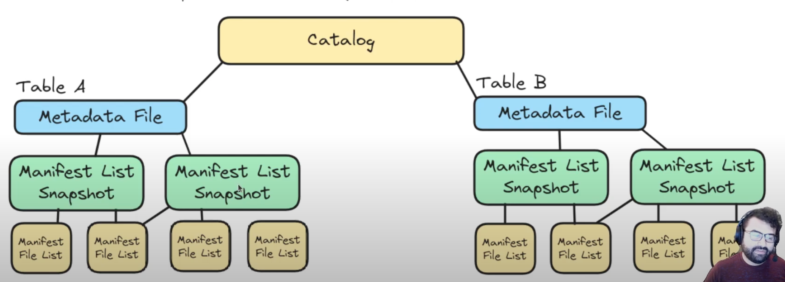
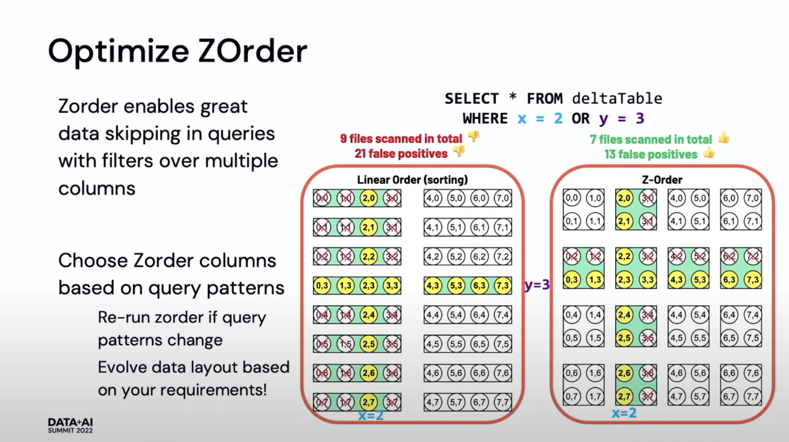

## Data lakehouse formats

Basically, data lakehouses consists from several components:
- Compute engine - Program, that perform all operations
- Metadata - Catalog to effectively manipulate with our files in lake
- Table format - Basic approach and API to manipulate with our files
- File format - Actually phycicall files (can be considered as part of Table format)
- Storage layer - Where our files are actually stored

We will focus right now on table format

It's crucial to understand, that formats, listed below it's not some programs, or data formats (like parquet, csv, etc).
It's **Table format**, which is combination of file format itself + set of APIs to different languagaes, to operate with that format.
So just a file - it's not enough.

What table format it is:
- Specifiaction/Standard: Basic approach of how to manipulate with some files (most table formats use parquets for actually store data)
- Set of APIs for different languages, that perform that approach

What table format isn't:
- It's not storage engine. You don't store files "in iceberg", for example. You store your data "with iceberg (approach)"
- It's not compute engine. Format itself it's not program/damon/process or somethin - every optimization done by that API/Convention, while you actually "call" to compute that files.

### Apache Iceberg ([docs](https://iceberg.apache.org/spec/#overview), [study resources](https://www.dremio.com/blog/apache-iceberg-101-your-guide-to-learning-apache-iceberg-concepts-and-practices/), [hands-on exapmple](https://youtube.com/playlist?list=PL-gIUf9e9CCuPu4Y-YgiHkqvmolS2YS2Y&si=HrpXUF5W0uqt9XLu))

First of all engine needs a data catalog.
It can be hive, for example, where latest path to Metadata file is stored.



All engine need that type of files in "Metadata" folder:
- **Metadata file** (core json file): Stores metadata about table in certain point in time. 
	- table_uuid
	- location
	- schema
	- partition-spec
	- current_snapshot_id
	- snapshots: list of pairs {snapshot_id, manifest_list}

- **Manifests list** (Basically it's snapshot of table (list of files that belong to table) in moment in time. list of manifest and short statistic about them in avro format)
	- manifest_path
	- added_snaphsot_id, which manifest belongs to
	- partition_spec_id, that we can use in our query
	- partitions: list of partition_info 
	
- **Manifest** (conatains list of stats about data files, in avro format)
	- file_path
	- file_format(parquet by default)
	- partition: part-field, data_type, data_value
	- record_count
	- null_value_stats: [{column1: num_of_nulls}, {column2: num_of_nulls}]
	- lower_bounds: [{column1: lower_bound}, {column2: lower_bound}]
	- upper_bounds: [{column1: upper_bound}, {column2: upper_bound}]

- **Data file** (parquet)


**Reading**: read metastore -> read metadata -> manifests list - > manifests -> data files
**Writing**: write to data file -> change manifest -> change manifest list ... -> change metadata file -> change metastore


**ACID**:
So, while each writing changes whole metadata, and we change our metastore each time (we point to newer version) in last order, and it can be happen only if all previous process goes well, that give us **ACID** write transactions, because, if transaction fails on lower levels - it didn't change the metadata, and our metastore still will be point on previous (last success) metadata file (which contains last good snapshot)

**Schema Evolution**:
Because all process looks like COW tables in hudi (each transaction makes new snapshot), and while we keep store previous versions of metadata, and because we store the schema in metadata file - we can just perform query with some time-travel where predicat, and it will go by old path with previous metadata and previous schema, and previous files underneath

**Partition Evolution**: Particularly in Iceber you can repartition your table without actually moving the files, because metadata written in files particullary, and you don't have to move them from folder to folder (like in general hive approach)

**Hidden partitioning**: If in our source data we have timestamp column, and if we want to partition regular parquets or so by date, we should physically create additional "date" column to partition by.
But in Iceberg you can use function to do that, and not to add additional column.
Which is more convinient to use

```sql
create table catalog.db.events (
	id 		bigint,
	value 	varchar,
	ts 		timestamp,
	-- dt  	date    <- no longer need that in inceberg
)
--partitioned by (dt); <- no longer need that in inceberg

using Iceberg
Partitioned by (date(ts));

-- and then just select
select id, value, ts
from catalog.db.events
where 1=1
	-- and dt between '2024-01-01' and '2024-02-01' <- no longer need that in inceberg
	and ts between '2024-01-01' and '2024-02-01'
```

**COW vs MOR**

Actually, Iceberg, has their MOR tables too, despite that it seemd (based on architecture pictures), that it's always COW tables. And by default thay are all COW, yes.

But Iceberg can add small "transactional files", to use them in MOR method, par example:
- **Position delete**: it's file with data filename and rownumber of rows, that need to be deleteed in that file. Which is slower, while you write that file, because you need to write all the row numbers
- **Equality delete**: it's column and value, that should be deleted. Which is faster on write, because you only use predicate value, but it's slower on read, because you need to compare that value with all of the row

All tables are COW by default, but you can change few settings to make them MOR:
- For update queries: write.update.mode
- For delete queries: write.delete.mode
- For merge  queries: write.merge.mode 

```sql
create table catalog.db.events (
	id 		bigint,
	value 	varchar,
	ts 		timestamp,
) tblproperties (
'write.update.mode'='copy-on-write',
'write.delete.mode'='merge-on-read'
)
using Iceberg
Partitioned by (date(ts));
```

**Table settings**
- Parquet vectorization - Change behaviour of how rows read (default off, but better turn it on)
- Write format
- Compression format - zstd, brotil, lz4, gzip, snappy, uncompressed (default gzip)
- Delete old metadata files - on/off and TTL (number of last files to keep)
- Column metric tracking - you can choose which only columns metadata you want to track and keep. To not lose compute for wide tables on some useless columns. Also you can choose which partiularly stats you want to track

**Maintaining Tables**
- Set TTL of snapshot (to delete old files)
- Expire snapshots manually with `call prod.system.expire_snapshots(table, older_than, retain_last)`
- Rewriting data files and Manifests for Compaction (basically for reordering) `Call catalog_name.system.rewrite_data_files(table, strategy, sort_order)` and `Call catalog_name.system.rewrite_manifests(table)`
- Delete Orphan files (from unsecceseful ACID jobs, where files changed, but meta - not) `Call catalog_name.system.remove_orphan_files(table, location)`

[Iceberg Qucik Overview from Dremio. Recommend](https://www.youtube.com/watch?v=stJLaIZRcJs)<br>
[Iceberg 101 Overview playlist from Dremio](https://www.youtube.com/playlist?list=PL-gIUf9e9CCskP6wP-NKRU9VhofMHYjcd)

### Delta Table

It's similar to Iceberg in some way: it's just parquets + logs/transactions

```
my_table
├── delta_log				# transaction log
│   ├── 00000.json			# table version
│   └── 00001.json  
├── date=2024-01-01        	# partition    
│   ├── file1.parquet		# table version  
│   ├── file2.parquet		# table version            
│   └── file3.parquet 
└── ...
```

**Atomicity:** Change to the table stored in logs. For example:
00000.json can contain (1. add file1.parquet to the table, 2. add file2.parquet to the table).
Each json in log call commit there

Delta lake use optimistic concurrency, which mean, if two processes both try to create 00002.json, only one will succed.
But second one, check if there is already 00002.json in logs, and if it is - it just check that commit, and if nothing changed 
(schema of the table, for example, or some other things that can affect our latest transaction) 
it's just increase the number of that transaction, and write it (00003.json)



[Databricks delta lake overview](https://www.youtube.com/watch?v=LJtShrQqYZY&pp=ygUKZGVsdGEgbGFrZQ%3D%3D)<br>
[Parquet from databricks](https://www.youtube.com/watch?si=WNrwVqCQ6SnsrB6I&v=1j8SdS7s_NY&feature=youtu.be)<br>
[Delta lake deep dive from databricks](https://www.youtube.com/watch?si=9ZpSYNHDg9726pM6&v=znv4rM9wevc&feature=youtu.be)<br>
[Delta lake 2.0 (incl. z-ordering)](https://www.youtube.com/watch?si=6S5D9s-2xyBDNb79&v=1TmjPe0mXTY&feature=youtu.be)<br>
[Spark optimization from databricks](https://www.youtube.com/watch?v=daXEp4HmS-E)<br>
[Delta lake (on russian)](https://www.youtube.com/watch?si=ReX58B4duoLPpqaD&v=znVE6fpQqAU&feature=youtu.be)<br>
[Hudi vs Delta vs Iceberg comparison](https://www.onehouse.ai/blog/apache-hudi-vs-delta-lake-vs-apache-iceberg-lakehouse-feature-comparison)<br>


### Hive Table

Stores files in directories and subdirectories.
directory represents a table
And each subdirectory is partition of that table

### Hoodie ([docs](https://hudi.apache.org/docs/concepts/))


#### COW vs MOR storage models

There is two basic principles of how hudi store data:

**Copy on Write**: Data is stored in a columnar format (Parquet), and each update creates a new version of files during a write. COW is the default storage type. So all the things happend on **writer side**


**Merge on read**: Data is stored using a combination of columnar (Parquet) and row-based (Avro) formats. Updates are logged to row-based delta files and are compacted as needed to create new versions of the columnar files.


**COW vs MR**:
So, in a nutshell, COW have bigger latency on writing, but faster reading. MOR - vice-versa.

[Table types in Hudi](https://medium.com/@simpsons/different-table-types-in-apache-hudi-datalake-apachehudi-cow-mor-f508c474cb8c)<br>
[Copy-on-write](https://medium.com/@Eswaramoorthy.P/demystifying-copy-on-write-in-apache-hudi-understanding-read-and-write-operations-3aa274017884)<br>
[COW vs MOR](https://www.onehouse.ai/blog/comparing-apache-hudis-mor-and-cow-tables-use-cases-from-uber-and-shopee)

#### Query types ([docs](https://hudi.apache.org/docs/next/table_types/))

**Snapshot query**: It's possibility to query present state of date. (it's like to have SCD1)

**Time Travel**: It is what it says - you can query state of the table in concrete moment of time. So it's like shapshot query, but you can "choose snapshot", that you need (imageine, that you have SCD2)

**Incremental query**: Query, that can see new data written/changed in the table from particular commit/point in time

**Read optimized Queries**: it's when you read only base parquet files, without implementing all new deltas, that probably have place. It's more efficient read, but probably you will lose some latest data, that haven't compacted to new base parquet file still

There are some limitations, so:
COW tables can take: Snapshot, Time Travel, Incremental and Incremental CDC queries
MOR tables can take: Snapshot, Time Travel, Incremental and Read optimized queries

And there are examples for each type of table:


[Article about different query types](https://medium.com/@simpsons/different-query-types-with-apache-hudi-e14c2064cfd6)

#### Indexes

**Global Index**: it's unique key all over the table, i.e. it guarantees, that exactly one row with that key exists in the whole table. It offer that stron guarantees, but uodate/delete it's quite costy operation

**Non-Global Index**: it's uniquet key only in the partition. So there is no such strong guarantees of uniqness, but it has better performance

##### Index types

- Bloom Index
- Simple Index
- HBase Index
- Bucket Index
- Bucket Index with consistent hashing

[Make upserts faster](https://www.onehouse.ai/blog/top-3-things-you-can-do-to-get-fast-upsert-performance-in-apache-hudi)<br>
[Bucket index](https://medium.com/@simpsons/speed-up-your-write-latencies-using-bucket-index-in-apache-hudi-2f7c297493dc)<br>
[Simple index](https://www.linkedin.com/pulse/apache-hudi-accelerating-upsert-simple-index-choosing-soumil-shah%3FtrackingId=pmENaqg9Rt6NG6aCzIQ2Eg%253D%253D/?trackingId=pmENaqg9Rt6NG6aCzIQ2Eg%3D%3D)

#### Operation Types ([docs](https://hudi.apache.org/docs/next/write_operations/#operation-types))

- Upsert: if row doesn't existed in table, it will be inserted. If it's already existed - it will be updated
- Delete: There are **soft** (it's only Null'ed all data in the row, but the row and key (!) will be remain) and **hard** (deletes whole row with an index) deletes in Hudi
- Insert: Just insert without scanning indexes, which can corrupt data, but it's pretty fast
- Insert overwrite ([article about](https://soumilshah1995.blogspot.com/2023/03/rfc-18-insert-overwrite-in-apache-hudi.html)): It's similar to upsert, but faster, because get rid of some index things. If you want to reinit some of your partition (for example you partitioned by date), you can just insert overwrite whole partition, and it will be fastest way to do that
- Delete partition: deletes entire partition
- Bulk insert ([article about](https://medium.com/@simpsons/bulk-insert-sort-modes-with-apache-hudi-c781e77841bc)): it's efficient when you deal with huge amoun of data

[AWS blog about hudi + glue](https://aws.amazon.com/blogs/big-data/part-1-get-started-with-apache-hudi-using-aws-glue-by-implementing-key-design-concepts/)<br>
[DeepDive video about Hudi](https://www.youtube.com/watch?v=nGcT6RPjez4)<br>
[Hudi QuickStart demo](https://hudi.apache.org/docs/docker_demo)<br>
[Hudi+PySpark example](https://medium.com/@sagarlakshmipathy/a-beginners-guide-to-apache-hudi-with-pyspark-part-1-of-2-8a4e78f6ad2e)<br>
[Getting started with Hudi](https://datacouch.medium.com/getting-started-with-apache-hudi-711b89c107aa)<br>
[Another one](https://medium.com/walmartglobaltech/a-beginners-guide-to-using-apache-hudi-for-data-lake-management-6af50ade43ad)<br>
