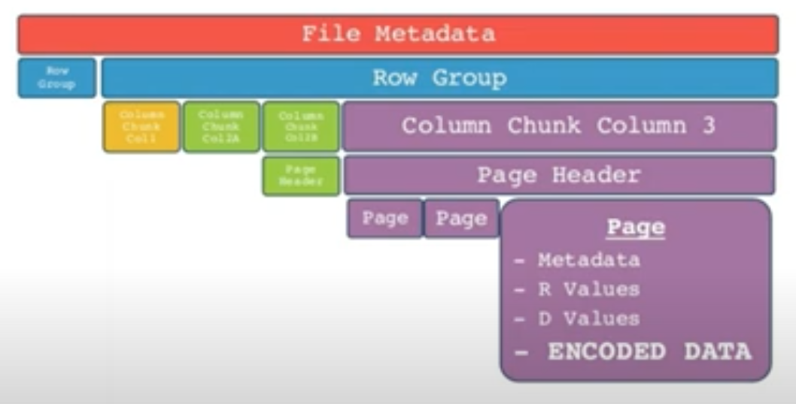

# Table formats

## Apache Parquet ([docs](https://parquet.apache.org/docs/file-format/))

phisycal models to store data can be these: 
example table: 
|rows|col_a|col_b|col_c|
|----|-----|-----|-----|
|row0| a0  | b0  | c0  |
|row1| a1  | b1  | c1  |
|row2| a2  | b2  | c2  |
|row3| a3  | b3  | c3  |

- Row-wise (each file contains some rows). they can united in longer rows, but, in a nutshell it's a continuous amount of rows. 
It's cool to use at row-store databases (obviously), for OLTP data-access pattern, so where you need to insert you just append row, where you need update/delete, you just need to find start of row, and read all continiously , because equential reading better for disk. 
it can be like in an example as is:

|     |     |     |     |     |     |
|-----|-----|-----|-----|-----|-----|
| a0  | b0  | c0  |	a1  | b1  | c1  |
| a2  | b2  | c2  | a3  | b3  | c3  |

- Pure Column-wise.

When your store one column in sequence. 
So, you need to find start of needed columns and read sequentially all data. 

|     |     |     |     |     |     |
|-----|-----|-----|-----|-----|-----|
| a0  | a1  | a2  |	a3  | b0  | b1  |
| b2  | b3  | c0  | c1  | c2  | c3  |

Or you can use different file for each column. Also, it's neccessary to undeerstand offset (~index) of each elemnt in file.
But it can be hard to organise that files physycally. So real-life implenetation of Parquet looks not like that, despite it's columnar table foramt

- Column-wise (Hybrid) _Parquet use that type_

That means, that you have both columns (horizontal) and columns(vertical) partitioning.

|     |     |     |     |     |     |
|-----|-----|-----|-----|-----|-----|
| a0  | a1  | b0  |	b1  | c0  | c1  |
| a2  | a3  | b2  | b3  | c2  | c3  |

So it's pure-columnar, but splitted by chunks (here is chunk length equals 2)

**So, high-level:** 

- Parquet file consits of one or more **Row group** (can be configured by user)
- **Row group** contains exactly one column chunk per column
- **Column chunk** contains one or more pages 
- **Page** it's individible part of parquet

**And example:** 

- 4-byte magic number "PAR1"
- Row-group 1 (128mb by default)
	- Column A chunk 0
		- Page 0
			- Page metadata 
				_min_, _max_, _count_
			- Repetition levels
			- Definition levels 
				_for nested schemas_
			- Encoded values 
				_actual data in encoding state_
		- ...
		- Page N
	- Column B chunk 0
	- ...
	- Column N chunk 0
- Row-group 2 
	- Column A chunk 1
		- Page 0
		- ...
		- Page N
	- Column B chunk 1
	- ...
	- Column N chunk 1
- Row-group M
- Footer **(File metadata)**
	- file
	- row-group 
	- column metadata start locations

**Parquet has 6 encoding schemes, but there basic:**  

- Plain
	- Fixed with: means, that values stored back-to-back. cool for integers, for example: 
		file example: 1, 5, 6, 3, ...
	- Non-fixed with: used for different length data (strings). in that case data have length prefix
		file example: 2, yo, 3, no, 8, hobahoba, ...

- RLE_Dictionary
	- Run-length encoding + bit-packing + dictionary compression
	- Assumes duplicate and repeated values

		example data:
		a, b, c, a, a, a, f, f, b, a

		dictionary-compression stage:
		_it's just creation of hashmap_
		a: 0, b:1, and so on

		so data will be
		0, 1, 2, 0, 0, 0, 6, 6, 1, 0

		RLE+Bit packaging stage:
		0, 1, 2, (3, 0), (2, 6), 1, 0

_Note1:_ beacuse of all that metadata things stored in file, and rowgroups, you shoukd avoid use small files
_Note2:_ Also avoid to use hufe files, because that means huge footer, but algorythms for foorer managment not optimized for speed.
_Note3:_ So, size of 1gb is ok

#### Conclusion about Parquet:

- Redused I/O
	- because of size (compression to RLE_Dictionary)
	- because of avoioding read irrelevant data (based on metadata min max and dictionary filtering)
- Redused overhead
	- if you avoid using small files
