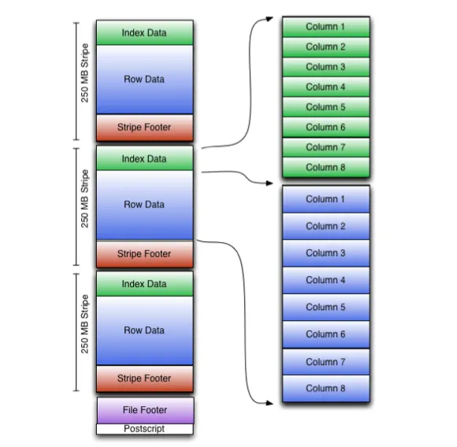
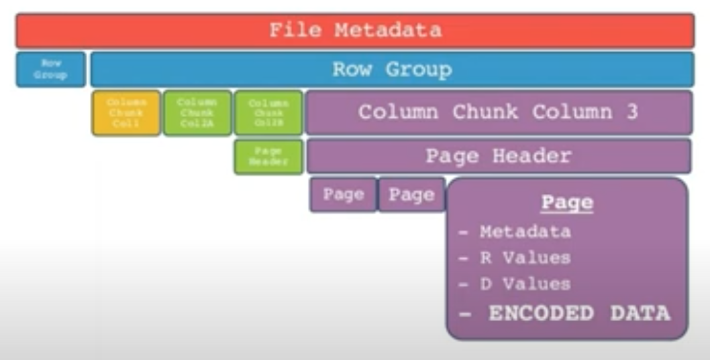
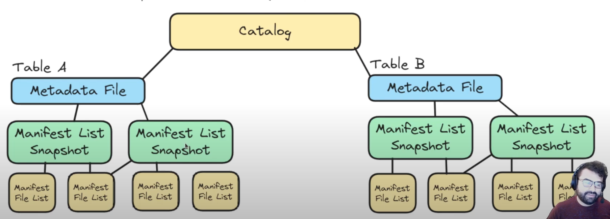
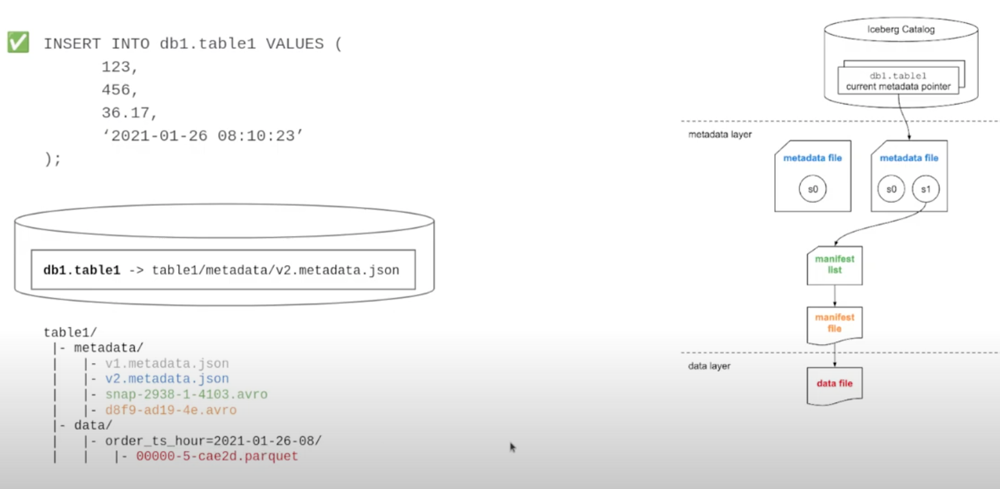
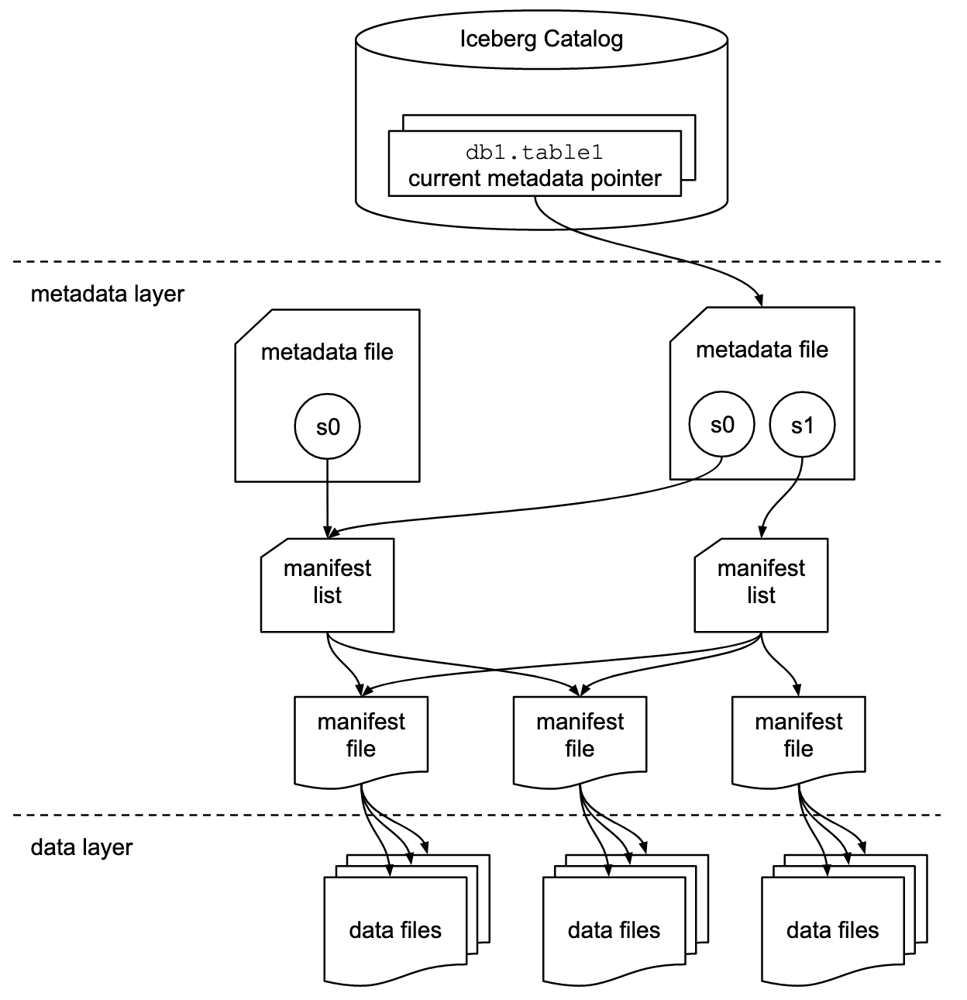
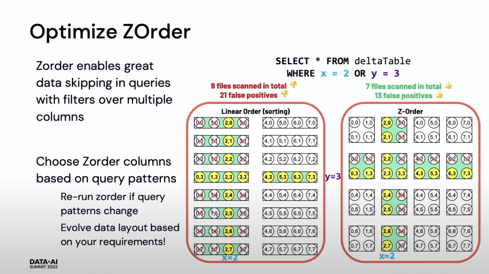
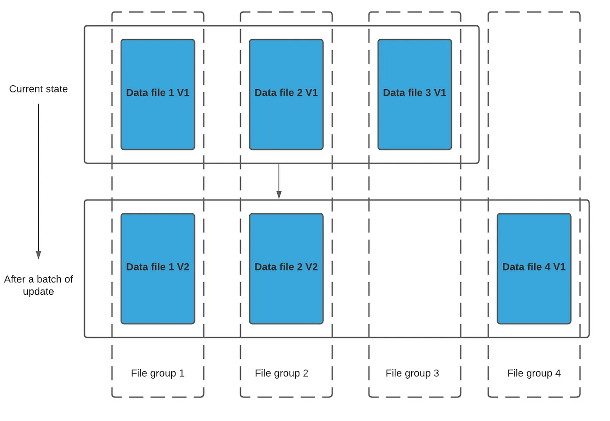
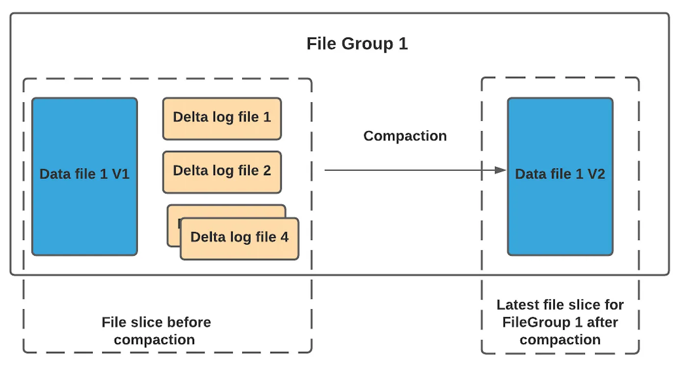
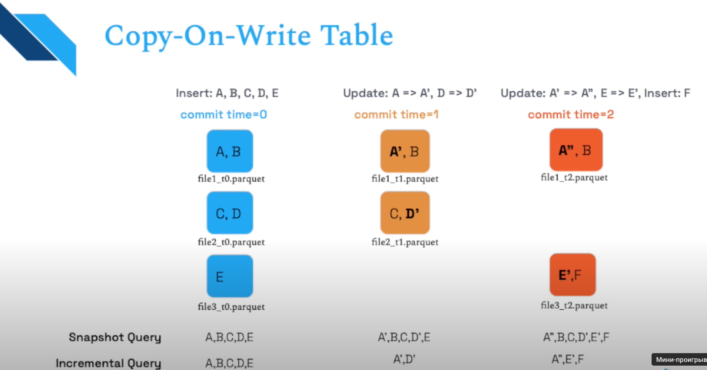
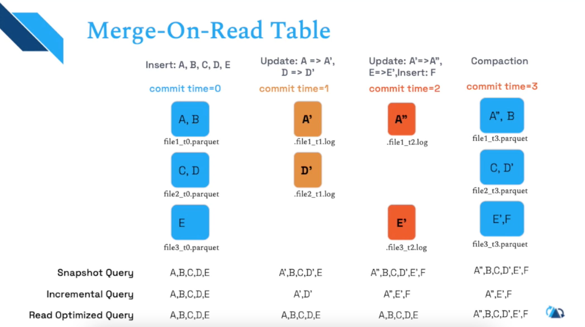

- [Databases](#databases)
  - [What is transaction?](#what-is-transaction)
  - [ACID (Properties of transaction)](#acid-properties-of-transaction)
  - [Consystency types:](#consystency-types)
  - [CAP, BASE](#cap-base)
  - [What is Cursor. Types of Cursors](#what-is-cursor-types-of-cursors)
  - [SQL vs NoSQL](#sql-vs-nosql)
  - [How JOIN works](#how-join-works)
  - [Indexes](#indexes)
  - [What is Database lock?](#what-is-database-lock)
  - [RowStore and ColumnStore](#rowstore-and-columnstore)
  - [Execution plan, Statistics (PostgrSQL)](#execution-plan-statistics-postgrsql)
  - [How data stored (PostgreSQL)](#how-data-stored-postgresql)
  - [Scalability, Distribution, Partition](#scalability-distribution-partition)
  - [PostgreSQL Don'ts](#postgresql-donts)
  - [Files](#files)
- [Table formats](#table-formats)
  - [Row vs Columnar file/data formats](#row-vs-columnar-filedata-formats)
  - [Row formats](#row-formats)
  - [Columnar formats](#columnar-formats)
  - [Enconding](#enconding)
  - [Data exchange protocols](#data-exchange-protocols)
- [Data lakehouse formats](#data-lakehouse-formats)
- [Data Architecture](#data-architecture)
  - [Lambda](#lambda)
  - [Kappa](#kappa)
  - [Delta](#delta)
  - [Inmon](#inmon)
  - [Kimpball](#kimpball)
  - [Data Vault](#data-vault)
  - [Anchor Model](#anchor-model)
- [SQL Review algorithm](#sql-review-algorithm)
- [SQL tasks](#sql-tasks)
  - [Questions](#questions)
  - [Coding tasks](#coding-tasks)
- [Additional Info](#additional-info)


# Databases

## What is transaction?

transaction - it's atomic operation, which can be completed fully, or not. <br>
We can combine different operations into one transaction, when we need to be sure, that they completed/not completed together

For example, when we transfer money from one account to another, we need to make it one logical transaction:

```sql
BEGIN TRANSACTION;

UPDATE bank_accounts
SET amount = amount - 100
WHERE user_id = 123

UPDATE bank_accounts
SET amount = amount + 100
WHERE user_id = 321

END TRANSACTION;
```

Transaction have these main commands:
- begin
- end / commit
- rollback

## ACID (Properties of transaction)

- **Atomicity** - means that operation (transaction) can be fully done or rollback'ed, yes or no, 1 or 0

- **Consistency** - it's logical property. In previous example with bank transfer consistency means, that total amount of money will be the same after transaction. It's like law of conservation of energy

- **Isolation** - it means, that each transaction independent of other transactions (see Isolation levels).
Isolation can be implemented in different ways, it's up to rdbms developers. Here some examples of **Isolation Levels**, from weakest, to strongest (approximately)

	- **Read Commited**: have two main parts:
		
		*Transaction can read only commited on changes, by the time that transaction started*
		
		- no dirty reads: other transactions don't read any uncommited changes
		- no dirty writes: other transaction, that wants to write need to wait until fist transaction commits

		It can be implemented by setting block for rows, that modified by transaction, so next transactions need to wait for their turn to modify some rows, when block will be released.
		Also, it will work for dirty reads: in case, when transaction try to read blocked row, she need to get pre-blocked state of that row

	- **Snapshot Isolation Level/Уepeatable read**: each transaction reads their own version of data, that commited when that transaction started

		- It can be implemented by:
          - storing few versions of each data, which called MVCC (multiversion concurrency control)
          - each transaction must have monotoniously increased id (txid)
          - each piece of data should hold store metadata with information about created transaction, deleted, modified, so based on that information each transaction can understand: can it "see" that data, or not

	- **Serializability**: Most strict isolation level. Guarantees that result of concurrenttly executed transactions will be the same as if they are executed serially (one by one). But implement that hardest level of isolation can down speed.

      - Serializibility implemented mainly in one of that ways:
          - sequential execution it's real isolation: when you have not so much transactions, and all of them fast you can just evaluate transactions really one by one
          - 2PL (2 phased lock): Transaction block some rows (by some predicat or something), and let it go after commit. It's quite slow, because in insert/update operations it's practicallly a sequential execution 
          - SSI (Serializable Snapshot Isolation): It use optimistic approach (while 2PL use pessimistic one). This approach based on Shapshot Isolation, but we also continously check transaction id (monotonically increasing value), and right before commiting transaction, transaction manager check, if there is transaction with bigger id commits some changes. If yes, our transaction should be rollbacked and rerunned

**Durability** - means, that if we get proof of end of transaction, that means, that there is can't happen something, to rollback that transaction, and it stored in database forever

## Consystency types:

**Isolation** is described in the context of transactions which consists of one or more read and write operations. On the other hand, **Consistency** is described in the context of atomic read or write operations.

- **Strict Consistency** - Full Consistency. Hard to achieve
- **Sequental consistency** - Guarantee, that latest processes will read/write newest value
- **Casual Consistency** - Data splits by dependend and independed. And Consistency exists only for Depended
- **Processor Consistency** - pass 
- **Weak Consistency** - pass
- **Eventual Consistency** - Means, that eventually (after some time) all data will be in consistent state 
- **Release Consistency** - pass
- **Entry Consistency** - pass

## CAP, BASE

it's concepts of how distributed system (not exactly database) should be made 

- Consistency
- Availiability
- Partitionability

Three of them almost impossible simaltaniously, and usually all picks Availiability and Partitionability
So there BASE approach:

- Basically availilale - In the end query will return result (but it can takes time)
- Soft State - All works without you
- Eventually Consistent - Eventual consistency

## What is Cursor. Types of Cursors

Area in memory, when result of query stored.
Can be client and server cursors.

## SQL vs NoSQL

by SQL it mostly means relational rowstored databases

No-SQL examples:

- **Column Store**: sparse matrix
	- CLickHouse
	- HBase
	- Google BigTable
	- Cassandra

- **Key:Value**: hash-table
	- S3
	- Voldemort

- **Document**: Tree
	- MongoDB

- **Graph**: graph
	- Allegro
	- InfinitieGraph

## How JOIN works

- **Nested Loop:**<br>
For each row of the left table, iterate over whole right table.<br>
it's O(NxM)<br><br>

- **Merge Join:**<br>
At first we need to sort both tables, and after that
for first row of left table find all rows in right table and stops (remember place, where stop)
For second row of left table loop started from that place, where stopped.<br>
It's O(N+M)<br><br>

- **Hash Join:**<br>
At first we need to create hashmap from smallest table.
Then for each row from biggest table we calculate hash() and go to the hasmap.<br>
It's O(N)<br><br>

- **Broadcast Join:**<br>
Usually used in distributed systems (Spark).
That strategy used, when right (any, ok) table are so small, that can be fully distributed to all nodes, where left table lays, and join there.<br>
It's O(N)<br><br>

## Indexes

### What is Index

**Index** - it's a separate data structure, that can perform select, but slow insert and update

In a nutshell - index it's like Table of contents for book. When you need particular chapter you don't need to fullscan all book. You can just look at TOC and see in which page range needed chapter are stored

Indexes can be clustered and nonclustered (In MSSQL, for example):

- **Clustered Index** - It's index, that part of the particular table. It can be only one clustered Index for each table, because Clustered index actually  (it's B-Tree in MSSQL)
- **Non-clustered Index** - It's separate from table "TOC". It can be many nonclustered indexes for each table

PostgreSQL doesn't have that concepts: all data stored in heaps, so all indexes are non-clustered.

It's more simpler to consider indexes as separate from data structure things, so clustered index - it's not really common thing

### Pluses et Minuses of indexes

**Pluses:** 
1. Faster select operations 
2. Phisycal sorting of data (but for clustered types of indexes only). If it will be unclustered index (most of it, tbh), it will be just additional data structure, that contains links to real data   

**Minuses:** 
1. Slowyng DML operations (UPDATE, INSERT, DELETE) because you need to rebuild index each time
2. Increasing of size of database (for non-clustered indexes)
3. It takes time to rebuild indexes  


### Basic Data base index types

- **B-Tree (Balanced)** - Most used type at that time. 

Just like tree, basically

- **Hash Index** - Mostly used for key:value storage

It's a hasmap, that stored somewhere in ram (for fast response).
Let's assume, that our DB it's simple file that store some key:value, and we only append new values to the end of the file

So our file looks like:
data:		 key1: 'value1', key2: 'value2', key3: 'value3'... 
position:    12345678910111213141516171819202122232425262728...

And in that case we need to store somewhere hashmap, which will contain key and offset (in bytes or symbols for simplicity)
key1: 1
key2: 13
etc

So when we need to find some value, we just scan our hasmap and go directly to needed offset

- **SS-Table**

pass

- **LSM-Tree**

pass

### PostgreSQL Types of Indexes:

B-Tree (default), Hash, Generalized Inverted Index (GIN), Generalized Search Tree (GiST), SP-GiST (Space-Partitioned GiST), Block Range Index (BRIN)

### When should indexes be avoided?

- You should not use indexes on small tables
- You should not use indexes on tables that face large and frequent batch UPDATE and INSERT operations
- You should not use indexes on columns that have many NULL values
- You should not use indexes on columns that are frequently edited
- When column have small selectivity (too little unique values, or even worse - when we have disbalance)

### When it's better not to have indexes, instead of having them?

In a nutshell, that's how process looks like:<br>
We go to the index, iterate over them, and go to particular data cells, with links, that mentioned in index.<br>

In that case, if, for example, we have table with our employees, and if we quite old company,<br>
that means, that flag `active_employee` will be on 90% filled with `False`. <br>
So if we want to select some of old employee, and if we have that field indexed, <br>
so we need to get to index and select 90% of rows with links in index. <br>
That whole "go to index -> find value -> go to link - > find real value" will be more time consuming, <br>
than simple fullscan in actual data

### Why you can't just create as many indexes as possible, if then so great?

Because each index should be rebuilt after any changes in table, which slow writes in database

## What is Database lock? 

*lock* - it's a "flag", that that particular object taken by some transaction, and that prevents other transactions perform operations over that object.
Because before starting operating, transaction should check if there is lock flag on object, or not. And if yes, transaction wont run.

Levels:
1. Database level - locks whole db.
2. Table level
3. Page level
4. Row level

Types:
1. Exclusive - just blocks any operations for that row/page/etc for other transactions
2. Shared - performed only for read transactions. That means, that object can get many shared locks, because all of that transactions only read it.
3. Predicate - It works with predicates as in where clause `where id > 100 and day_id = '2023-09-30'`

## RowStore and ColumnStore

### Rowstore

Data stored by rows, so DBMS iterate over rows and handle all the data.<br>
Mostly used for operations, that involves whole raw

- **Pro**: 
	- It's cool for __OLTP__, because it's easy to append data at the end: you write in only one file (in general)
- **Contra**: 
	- In queries you need to handle all row with you, that fill memory

### Columnstore

Data stored by colummns, so RDBMS iterate over rows and handle all the data.<br>
Nice to have, when most of your operations involve not whole rows, but some columns only


- **Pro**:
	- It's cool for __OLAP__, because generally you select only some columns, so RDMBS need to take care only of that particular columns, and don't store additional data
	- It's simple to compress columns, for example you can compress column AAAAAAABBCCAAA to A7B2C2A3  (and then apply BitMap, for example)
- **Contra**:
	- It takes more time to insert data, becaues you need to insert data in all columns files


## Execution plan, Statistics (PostgrSQL)

### Execution plan

It's logical plan, which RDBMS will use to execute query. Can be run by two commands.

It's a tree where each leaf it's operation.
And each operation have their own cost, that can be changed by administrator (but default pretty ok for most cases)
PostgreSQL Planner select right plan by himself, and you can't "help" with that

- **Explain** - It's shows estimated (!) plan to given query
- **Explain Analyze** - It actually runs (!) query and then shows protocol of actually ised plan

Operations in execution plan:
- **Scan** - Selection of data
- **Bitmap** - Bit Maps construction
- **Sort, Aggregate, Append, Limit** - Actual operations with data
- **Intersect, Except** - Sets operations
- **Nested loop, hash join, merge join** - Joins
- **Init Plan, SubPlan** - Nested queries

Information that execution plan gives:
- **cost** - Operation cost
- **rows** - amount of rows
- **width** - width/weight (in bytes!)
- **output** - returned columns
- **actual** - actual data (shown only in analyze)
- **buffers** - weight of data
- **rows removed** - removed rows

Scan operations:
- **Sequential Scan** - sequential (full) scan
- **Index Scan** - scan of index
- **Index only Scan** - scan of index only
- **TID Scan** - scan for phisical row identifier
- **CTE Scan** - scan of CTE tables
- **Values Scan** - scan of constants
- **Function Scan** - scan of result of function

### Statistics

Stored in two tables, basically:

- **pg_class**
	- reltuples: amount of rows
	- relpages: amount of pages

- **pg_statistics**(table)/**pg_stats**(view)
Store data about fields/columns of table

	- null_frac: share of nulls
	- n_distinct: share of unique values
	- most_common_values: array of most frequent values (100 limit by default, but can be changed)
	- most_common_freqs: array of freauency of that most frequent values

### Weigth of some basic types in db

|type|bytes|
|----|-----|
|bool|1|
|int2|2|
|int4|4|
|int8|8|
|varchar(n)|n+4|
|char(n)|n+4|
|timestamp|8|

## How data stored (PostgreSQL)

Table consist of segments.

Segment consist of pages.

In each page stored actual data.
Write in each page performs in two directions:
from start of file added pointers to data
from end added actual data

Index data structure looks the same, but pointers in pages look not onto data, but on links to data

## Scalability, Distribution, Partition

Two main scalability options:
- Master-Slave:
	slaves hold copies of master, and clients send queries to less loaded slave

- Sharding:
	When you split data to different machines (like partitioning, but on machines)

- Distribution:
	Process, that distributes data by some key (random, preferrably), on smaller parts, so all nodes can perform query

- Partitions:
	Partition by monthes (for example)

## PostgreSQL Don'ts

[Nice link to explore](https://wiki.postgresql.org/wiki/Don%27t_Do_This)

## Files

### Unstructured

Fully no schema, so you need to parse it somehow.<br>
It's schema on-read.

- txt

### Semi-structured

Not really contains the schema, but it's the steps in the right direction.<br>
That data formats have some rules to create file, so it helps, but they are still **schema on-read**.

- csv/tsv/psv
- xml
- json

### Structured

Structured, means, that files have schemas, so you 100% shure, how you should handle each element in file.<br>
it's schema on-write.

- avro
- parquet
- etc...

# Table formats

## Row vs Columnar file/data formats 

phisycal models to store data can be these:<br>
example table:<br>

|rows|col_a|col_b|col_c|
|----|-----|-----|-----|
|row0| a0  | b0  | c0  |
|row1| a1  | b1  | c1  |
|row2| a2  | b2  | c2  |
|row3| a3  | b3  | c3  |

- Row format (each file contains some rows). they can united in longer rows, but, in a nutshell it's a continuous amount of rows.<br>
It's cool to use at row-store formats/dbs, **for OLTP/Write data-access pattern**, where you need to insert you just append row, where you need update/delete, you just need to find start of row, and read all continiously , because equential reading better for disk.<br>
it can be like in an example as is:

|     |     |     |     |     |     |
|-----|-----|-----|-----|-----|-----|
| a0  | b0  | c0  |	a1  | b1  | c1  |
| a2  | b2  | c2  | a3  | b3  | c3  |


- Pure Columnar

When your store one column in sequence.<br>
So, you need to find start of needed columns and read sequentially all data.<br>

|     |     |     |     |     |     |
|-----|-----|-----|-----|-----|-----|
| a0  | a1  | a2  |	a3  | b0  | b1  |
| b2  | b3  | c0  | c1  | c2  | c3  |

Or you can use different file for each column. Also, it's neccessary to undeerstand offset (~index) of each elemnt in file.
But it can be hard to organise that files physycally. So real-life implenetation of Parquet looks not like that, despite it's columnar table foramt

Columnar format **better suited for OLAP load pattern**, when you need to read from file/db

- Columnar (Hybrid)

That means, that you have both columns (horizontal) and columns(vertical) partitioning.

|     |     |     |     |     |     |
|-----|-----|-----|-----|-----|-----|
| a0  | a1  | b0  |	b1  | c0  | c1  |
| a2  | a3  | b2  | b3  | c2  | c3  |

So it's pure-columnar, but splitted by chunks (here is chunk length equals 2)

## Row formats

### Apahe Avro ([doc1](https://avro.apache.org/docs/), [doc2](https://avro.apache.org/docs/1.11.1/getting-started-python/)) 

it's an row format.
It also can be understood as json, but serialised in binary (which is oversimplifies whole thing, but still)

[nice video about avro internals](https://www.youtube.com/watch?v=0HsMaiLbXFk)

## Columnar formats

### ORC (Optimized Row Columnar) ([docs](https://cwiki.apache.org/confluence/display/Hive/LanguageManual+ORC))



ORC it's pure Columnar storaging format

[Article about ORC](https://medium.com/data-and-beyond/exploring-the-orc-file-format-advantages-use-cases-and-best-practices-for-data-storage-and-79c607ee9289)

ORC **optimized for reading**, mostly, because it has predicate pushdown, which allows Spark to skip over irrelevant data when querying large datasets.

### Apache Parquet ([docs](https://parquet.apache.org/docs/file-format/), [overview](https://learncsdesigns.medium.com/understanding-apache-parquet-d722645cfe74))

Parquet uses Columnar (hybrid) storaging format

**So, high-level:**<br>

- Parquet file consits of one or more **Row group** (can be configured by user)
- **Row group** contains exactly one column chunk per column (it's batch of columns)
- **Column chunk** contains one or more pages (it's part of column data)
- **Page** it's individible part of parquet

**And example:**<br>


- 4-byte magic number "PAR1"
- Row-group 1 (128mb by default)
	- Column A chunk 0
		- Page 0
			- Page metadata<br>
				_min_, _max_, _count_
			- Repetition levels
			- Definition levels<br>
				_for nested schemas_
			- Encoded values<br>
				_actual data in encoding state_
		- ...
		- Page N
	- Column B chunk 0
	- ...
	- Column N chunk 0
- Row-group 2 
	- Column A chunk 1
		- Page 0
		- ...
		- Page N
	- Column B chunk 1
	- ...
	- Column N chunk 1
- Row-group M
- Footer **(File metadata)**
	- file
	- row-group 
	- column metadata start locations



**Parquet has 6 encoding schemes, but there basic:** <br>

- Plain
	- Fixed width: means, that values stored back-to-back. cool for integers, for example:<br>
		file example: 1, 5, 6, 3, ...
	- Non-fixed width: used for different length data (strings). in that case data have length prefix
		file example: 2, yo, 3, no, 8, hobahoba, ...

- RLE_Dictionary (run-length encoding)
	- Run-length encoding + bit-packing + dictionary compression
	- Assumes duplicate and repeated values

		example data:
		a, b, c, a, a, a, f, f, b, a

		dictionary-compression stage:
		_it's just creation of hashmap_
		a: 0, b:1, and so on

		so data will be
		0, 1, 2, 0, 0, 0, 6, 6, 1, 0

		RLE+Bit packaging stage:
		0, 1, 2, (3, 0), (2, 6), 1, 0

_Note1:_ beacuse of all that metadata things stored in file, and rowgroups, you shoukd avoid use small files
_Note2:_ Also avoid to use hufe files, because that means huge footer, but algorythms for foorer managment not optimized for speed.
_Note3:_ So, size of 1gb is ok

#### Conclusion about Parquet:

- Redused I/O
	- because of size (compression to RLE_Dictionary)
	- because of avoioding read irrelevant data (based on metadata min max and dictionary filtering)
- Redused overhead
	- if you avoid using small files

Parquet is **optimized for write-heavy workloads**, as it includes features such as encoding and dictionary compression that can improve write performance.

### Apache Arrow ([docs](https://arrow.apache.org/overview/))

its in-memory columnar format, which makes easier and faster tranfser between compnents.

Without a standard columnar data format, every database and language has to implement its own internal data format. This generates a lot of waste. Moving data from one system to another involves costly serialization and deserialization. In addition, common algorithms must often be rewritten for each data format.

Arrow's in-memory columnar data format is an out-of-the-box solution to these problems. Systems that use or support Arrow can transfer data between them at little-to-no cost. Moreover, they don't need to implement custom connectors for every other system. On top of these savings, a standardized memory format facilitates reuse of libraries of algorithms, even across languages.


[Video about arrow from creator](https://www.youtube.com/watch?v=R4BIXbfKBtk&t=548s)

## Enconding

We talked about formats there, but most of them impossible without enconding.
We can determine two main types of encoding:
- **loseless** - compression without losing any data
- **lossy** - we don't consider it in dat world, because don't want to lose anything

Most frequently used type of loselss encoding is **Run-length Encoding (RLE)**
par example, your data is:
*aaabbcdddddeefggg*

then you can encode it as symbol+number of reprtitions
*a3b2c1d4e2f1g2*

which can save you a space

Obviously, RLE most effective in sorted data!
So, if you choose thr encoding type of your Parquet file, make sure, that it's sorted somehow, so you will actually get that bonuses of encoding. Because there can be such situation, where RLE-encoded file will take similar space or even more(!), than without encoding 

## Data exchange protocols

It's protocols of exchanging binary data between machines

- **Thrift**
- **ProtoBuf (Protocol buffers)**


# Data lakehouse formats

Basically, data lakehouses consists from several components:
- Compute engine - Program, that perform all operations
- Metadata - Catalog to effectively manipulate with our files in lake
- Table format - Basic approach and API to manipulate with our files
- File format - Actually phycicall files (can be considered as part of Table format)
- Storage layer - Where our files are actually stored

We will focus right now on table format

It's crucial to understand, that formats, listed below it's not some programs, or data formats (like parquet, csv, etc).
It's **Table format**, which is combination of file format itself + set of APIs to different languagaes, to operate with that format.
So just a file - it's not enough.

What table format it is:
- Specifiaction/Standard: Basic approach of how to manipulate with some files (most table formats use parquets for actually store data)
- Set of APIs for different languages, that perform that approach

What table format isn't:
- It's not storage engine. You don't store files "in iceberg", for example. You store your data "with iceberg (approach)"
- It's not compute engine. Format itself it's not program/damon/process or somethin - every optimization done by that API/Convention, while you actually "call" to compute that files.

### Apache Iceberg ([docs](https://iceberg.apache.org/spec/#overview), [study resources](https://www.dremio.com/blog/apache-iceberg-101-your-guide-to-learning-apache-iceberg-concepts-and-practices/), [hands-on exapmple](https://youtube.com/playlist?list=PL-gIUf9e9CCuPu4Y-YgiHkqvmolS2YS2Y&si=HrpXUF5W0uqt9XLu))

First of all engine needs a data catalog.
It can be hive, for example, where latest path to Metadata file is stored.



All engine need that type of files in "Metadata" folder:
- **Metadata file** (core json file): Stores metadata about table in certain point in time. 
	- table_uuid
	- location
	- schema
	- partition-spec
	- current_snapshot_id
	- snapshots: list of pairs {snapshot_id, manifest_list}

- **Manifests list** (Basically it's snapshot of table (list of files that belong to table) in moment in time. list of manifest and short statistic about them in avro format)
	- manifest_path
	- added_snaphsot_id, which manifest belongs to
	- partition_spec_id, that we can use in our query
	- partitions: list of partition_info 
	
- **Manifest** (conatains list of stats about data files, in avro format)
	- file_path
	- file_format(parquet by default)
	- partition: part-field, data_type, data_value
	- record_count
	- null_value_stats: [{column1: num_of_nulls}, {column2: num_of_nulls}]
	- lower_bounds: [{column1: lower_bound}, {column2: lower_bound}]
	- upper_bounds: [{column1: upper_bound}, {column2: upper_bound}]

- **Data file** (parquet)



**Reading**: read metastore -> read metadata -> manifests list - > manifests -> data files
**Writing**: write to data file -> change manifest -> change manifest list ... -> change metadata file -> change metastore



**ACID**:
So, while each writing changes whole metadata, and we change our metastore each time (we point to newer version) in last order, and it can be happen only if all previous process goes well, that give us **ACID** write transactions, because, if transaction fails on lower levels - it didn't change the metadata, and our metastore still will be point on previous (last success) metadata file (which contains last good snapshot)

**Schema Evolution**:
Because all process looks like COW tables in hudi (each transaction makes new snapshot), and while we keep store previous versions of metadata, and because we store the schema in metadata file - we can just perform query with some time-travel where predicat, and it will go by old path with previous metadata and previous schema, and previous files underneath

**Partition Evolution**: Particularly in Iceber you can repartition your table without actually moving the files, because metadata written in files particullary, and you don't have to move them from folder to folder (like in general hive approach)

**Hidden partitioning**: If in our source data we have timestamp column, and if we want to partition regular parquets or so by date, we should physically create additional "date" column to partition by.
But in Iceberg you can use function to do that, and not to add additional column.
Which is more convinient to use

```sql
create table catalog.db.events (
	id 		bigint,
	value 	varchar,
	ts 		timestamp,
	-- dt  	date    <- no longer need that in inceberg
)
--partitioned by (dt); <- no longer need that in inceberg

using Iceberg
Partitioned by (date(ts));

-- and then just select
select id, value, ts
from catalog.db.events
where 1=1
	-- and dt between '2024-01-01' and '2024-02-01' <- no longer need that in inceberg
	and ts between '2024-01-01' and '2024-02-01'
```

**COW vs MOR**

Actually, Iceberg, has their MOR tables too, despite that it seemd (based on architecture pictures), that it's always COW tables. And by default thay are all COW, yes.

But Iceberg can add small "transactional files", to use them in MOR method, par example:
- **Position delete**: it's file with data filename and rownumber of rows, that need to be deleteed in that file. Which is slower, while you write that file, because you need to write all the row numbers
- **Equality delete**: it's column and value, that should be deleted. Which is faster on write, because you only use predicate value, but it's slower on read, because you need to compare that value with all of the row

All tables are COW by default, but you can change few settings to make them MOR:
- For update queries: write.update.mode
- For delete queries: write.delete.mode
- For merge  queries: write.merge.mode 

```sql
create table catalog.db.events (
	id 		bigint,
	value 	varchar,
	ts 		timestamp,
) tblproperties (
'write.update.mode'='copy-on-write',
'write.delete.mode'='merge-on-read'
)
using Iceberg
Partitioned by (date(ts));
```

**Table settings**
- Parquet vectorization - Change behaviour of how rows read (default off, but better turn it on)
- Write format
- Compression format - zstd, brotil, lz4, gzip, snappy, uncompressed (default gzip)
- Delete old metadata files - on/off and TTL (number of last files to keep)
- Column metric tracking - you can choose which only columns metadata you want to track and keep. To not lose compute for wide tables on some useless columns. Also you can choose which partiularly stats you want to track

**Maintaining Tables**
- Set TTL of snapshot (to delete old files)
- Expire snapshots manually with `call prod.system.expire_snapshots(table, older_than, retain_last)`
- Rewriting data files and Manifests for Compaction (basically for reordering) `Call catalog_name.system.rewrite_data_files(table, strategy, sort_order)` and `Call catalog_name.system.rewrite_manifests(table)`
- Delete Orphan files (from unsecceseful ACID jobs, where files changed, but meta - not) `Call catalog_name.system.remove_orphan_files(table, location)`

[Iceberg Qucik Overview from Dremio. Recommend](https://www.youtube.com/watch?v=stJLaIZRcJs)<br>
[Iceberg 101 Overview playlist from Dremio](https://www.youtube.com/playlist?list=PL-gIUf9e9CCskP6wP-NKRU9VhofMHYjcd)

### Delta Table

It's similar to Iceberg in some way: it's just parquets + logs/transactions

```
my_table
├── delta_log				# transaction log
│   ├── 00000.json			# table version
│   └── 00001.json  
├── date=2024-01-01        	# partition    
│   ├── file1.parquet		# table version  
│   ├── file2.parquet		# table version            
│   └── file3.parquet 
└── ...
```

**Atomicity:** Change to the table stored in logs. For example:
00000.json can contain (1. add file1.parquet to the table, 2. add file2.parquet to the table).
Each json in log call commit there

Delta lake use optimistic concurrency, which mean, if two processes both try to create 00002.json, only one will succed.
But second one, check if there is already 00002.json in logs, and if it is - it just check that commit, and if nothing changed 
(schema of the table, for example, or some other things that can affect our latest transaction) 
it's just increase the number of that transaction, and write it (00003.json)



[Databricks delta lake overview](https://www.youtube.com/watch?v=LJtShrQqYZY&pp=ygUKZGVsdGEgbGFrZQ%3D%3D)<br>
[Parquet from databricks](https://www.youtube.com/watch?si=WNrwVqCQ6SnsrB6I&v=1j8SdS7s_NY&feature=youtu.be)<br>
[Delta lake deep dive from databricks](https://www.youtube.com/watch?si=9ZpSYNHDg9726pM6&v=znv4rM9wevc&feature=youtu.be)<br>
[Delta lake 2.0 (incl. z-ordering)](https://www.youtube.com/watch?si=6S5D9s-2xyBDNb79&v=1TmjPe0mXTY&feature=youtu.be)<br>
[Spark optimization from databricks](https://www.youtube.com/watch?v=daXEp4HmS-E)<br>
[Delta lake (on russian)](https://www.youtube.com/watch?si=ReX58B4duoLPpqaD&v=znVE6fpQqAU&feature=youtu.be)<br>
[Hudi vs Delta vs Iceberg comparison](https://www.onehouse.ai/blog/apache-hudi-vs-delta-lake-vs-apache-iceberg-lakehouse-feature-comparison)<br>


### Hive Table

Stores files in directories and subdirectories.
directory represents a table
And each subdirectory is partition of that table

### Hoodie ([docs](https://hudi.apache.org/docs/concepts/))

#### COW vs MOR storage models

There is two basic principles of how hudi store data:

**Copy on Write**: Data is stored in a columnar format (Parquet), and each update creates a new version of files during a write. COW is the default storage type. So all the things happend on **writer side**



**Merge on read**: Data is stored using a combination of columnar (Parquet) and row-based (Avro) formats. Updates are logged to row-based delta files and are compacted as needed to create new versions of the columnar files.



**COW vs MR**:
So, in a nutshell, COW have bigger latency on writing, but faster reading. MOR - vice-versa.

[Table types in Hudi](https://medium.com/@simpsons/different-table-types-in-apache-hudi-datalake-apachehudi-cow-mor-f508c474cb8c)<br>
[Copy-on-write](https://medium.com/@Eswaramoorthy.P/demystifying-copy-on-write-in-apache-hudi-understanding-read-and-write-operations-3aa274017884)<br>
[COW vs MOR](https://www.onehouse.ai/blog/comparing-apache-hudis-mor-and-cow-tables-use-cases-from-uber-and-shopee)

#### Query types ([docs](https://hudi.apache.org/docs/next/table_types/))

**Snapshot query**: It's possibility to query present state of date. (it's like to have SCD1)

**Time Travel**: It is what it says - you can query state of the table in concrete moment of time. So it's like shapshot query, but you can "choose snapshot", that you need (imageine, that you have SCD2)

**Incremental query**: Query, that can see new data written/changed in the table from particular commit/point in time

**Read optimized Queries**: it's when you read only base parquet files, without implementing all new deltas, that probably have place. It's more efficient read, but probably you will lose some latest data, that haven't compacted to new base parquet file still

There are some limitations, so:
COW tables can take: Snapshot, Time Travel, Incremental and Incremental CDC queries
MOR tables can take: Snapshot, Time Travel, Incremental and Read optimized queries

And there are examples for each type of table:





[Article about different query types](https://medium.com/@simpsons/different-query-types-with-apache-hudi-e14c2064cfd6)

#### Indexes

**Global Index**: it's unique key all over the table, i.e. it guarantees, that exactly one row with that key exists in the whole table. It offer that stron guarantees, but uodate/delete it's quite costy operation

**Non-Global Index**: it's uniquet key only in the partition. So there is no such strong guarantees of uniqness, but it has better performance

##### Index types

- Bloom Index
- Simple Index
- HBase Index
- Bucket Index
- Bucket Index with consistent hashing

[Make upserts faster](https://www.onehouse.ai/blog/top-3-things-you-can-do-to-get-fast-upsert-performance-in-apache-hudi)<br>
[Bucket index](https://medium.com/@simpsons/speed-up-your-write-latencies-using-bucket-index-in-apache-hudi-2f7c297493dc)<br>
[Simple index](https://www.linkedin.com/pulse/apache-hudi-accelerating-upsert-simple-index-choosing-soumil-shah%3FtrackingId=pmENaqg9Rt6NG6aCzIQ2Eg%253D%253D/?trackingId=pmENaqg9Rt6NG6aCzIQ2Eg%3D%3D)

#### Operation Types ([docs](https://hudi.apache.org/docs/next/write_operations/#operation-types))

- Upsert: if row doesn't existed in table, it will be inserted. If it's already existed - it will be updated
- Delete: There are **soft** (it's only Null'ed all data in the row, but the row and key (!) will be remain) and **hard** (deletes whole row with an index) deletes in Hudi
- Insert: Just insert without scanning indexes, which can corrupt data, but it's pretty fast
- Insert overwrite ([article about](https://soumilshah1995.blogspot.com/2023/03/rfc-18-insert-overwrite-in-apache-hudi.html)): It's similar to upsert, but faster, because get rid of some index things. If you want to reinit some of your partition (for example you partitioned by date), you can just insert overwrite whole partition, and it will be fastest way to do that
- Delete partition: deletes entire partition
- Bulk insert ([article about](https://medium.com/@simpsons/bulk-insert-sort-modes-with-apache-hudi-c781e77841bc)): it's efficient when you deal with huge amoun of data

[AWS blog about hudi + glue](https://aws.amazon.com/blogs/big-data/part-1-get-started-with-apache-hudi-using-aws-glue-by-implementing-key-design-concepts/)<br>
[DeepDive video about Hudi](https://www.youtube.com/watch?v=nGcT6RPjez4)<br>
[Hudi QuickStart demo](https://hudi.apache.org/docs/docker_demo)<br>
[Hudi+PySpark example](https://medium.com/@sagarlakshmipathy/a-beginners-guide-to-apache-hudi-with-pyspark-part-1-of-2-8a4e78f6ad2e)<br>
[Getting started with Hudi](https://datacouch.medium.com/getting-started-with-apache-hudi-711b89c107aa)<br>
[Another one](https://medium.com/walmartglobaltech/a-beginners-guide-to-using-apache-hudi-for-data-lake-management-6af50ade43ad)<br>

# Data Architecture

## Lambda

It's a parallel computing of streams and batches.<br>
You stream continously, but whith some periodicity you overwrite stream data with batch processed data

 
 ```
            Batch layer 
        /                 \
 Source                     Serving layer
        \                 /
          Streaming layer
```

Pro:
- speed from stream
- reliability from batch
- simple reprocessing (just restart batch process for needed period) 

Contra:
- You need to handle same business logic for two of that processes

## Kappa

In that architecture you consider batches as a special case of streaming

```Source - Log - Streaming layer - Serving layer```

And streaming layer contains log (like databases do, in ther replication process)

So when you need to reprocess something, you just delete old stream and restart it from some checkpoint in log.

Pro:
- fast streaming

Contra:
- reprocessing can be hard. You need to choose right instruments, to not end up like regular streaming 

## Delta

it's "unofficial" architecture pattern, based on delta lake capabilities<br>

It's like Kappa, but based on delta lake, so it's much more simpler to reprocess

### Delta Table
	It's framework, based on Parquet files, but it's implement ACID'ness for handling concurrent access to one parquet file.
	Delta lake handle all files in Parquet, but also has transaction log (json), which contains all transactions info.
	Every 10 transactions that json converts to new parquet checkpoint, so it will be simpler to read it.

	Delta lake has optimistic concurrency control, so when two transactions start manipulate with data, based on same log id file, when transaction finished, it need to check, if there their base log id still latest. If not - transaction reprocess it, based on new transaction log

## Inmon

It's approach, where you at first create normalized tables, and only after you create needed dashboards

pro:
- you can create new dashboards easily from already prepared data

contra:
- some dashboards can overlap information (no single source of truth)

## Kimpball

In this approach you need at first to understand, which dashboards do you need, and after that make ETL processes exactly for them

pro:
- single source of truth

contra:
- you need to implement full etl process for each dashboard

## Data Vault

Killer-feature of that approach - it's to separate data and relations (so you will not use PK-FK relations between fact tables)

You have this objects:
- Hub: contains only business object. Key can be business key, or surrogate key (hash from business)
- Sattelite: contains information about object (you can create as many satellites, as you want). can be linked only to hub
- Link: contains relations between Hubs

Also, in Data Vault paradigm Link-tables can have their own satellite (to store facts)

## Anchor Model

Pretty similar to Data Vault, but it's on hard-mode

You have this objects:
- Anchor: contains only business object. And contains only surrogate key. Business key it's just an attribute
- Attribute: contains information about object, and you should create table for each attribute
- Tie: contains relations between Anchors
- Knot: it's object for Anchor+Attribute, but i don't sure, that you want to use it.

And in AM you can't link Attributes tables to Tie


# SQL Review algorithm

Me, personnaly divide review to three parts:

1. **Is code working as it is?**
	*In standalone environment. There i need to check all logic inside functions and so on. It's similar to unit-testing, and in test covered production maybe not so nessecary, because we assume, that code tested before pull request*

2. **Will code be working in production environment?**
	*How that code will interact with other things in production?*

	- Is the pipeline idempotent? 
	- Are they incorrectly using "current time" in the pipeline?
	- Are they using date > "start date" without a corresponding date < "end date" 
	- Are they doing JOINs with SCD (slowly changing dimension) tables that don't have the needed timeframe filters?
    - Is there "dtm", "source", another technical fields?

	- Is the data model efficient? 
	- Is there any excessive data duplication?
    - Is SQL efficient?
    - Is there nulls, how it handled?
	- Could they leverage complex data types for a better model?  
	- Are the column names reasonable and understandable? 

	- Do they have data quality checks at all?
	- Are they checking for NULLs, duplicates, and malformed values?
	- Are they doing row count anomaly detection?  
	- Will any of these quality checks be excessively noisy?

	- Can pipeline be less costy (in cloud solutions)?

3. **Refactoring**
	*Can code be cleaner, with the same functionality?*
 

# SQL tasks

## Questions

- Difference between Truncate and Delete: Delete delete row by row and log that. Truncate just drop whole table and recreates it
- What languages SQL has?: DDL (definition: create, alter), DML (manipulation: select), DCL (control: grant)
- Can you join with Null?: No, Null - not compatible, so Join Null on Null will be Null, so result will not appeared
- Difference between Union and Union ALL: Union drop duplicates in result query
- What types of window functions do you know?
    
    - lag(): previous row
    - lead(): next row
    - rownumber: just add rows number counter
    - rank: if there two rows with the same number, next number will be skipped
    - dense rank: no numbers skipped
    - min, max, etc.

- What is order of opertation:
    1. From
    2. Join
    3. Where
    4. Group by
    5. Having
    6. Select + Window functions
    7. Order by
    8. Limit

- What is normaliztion, which advantages it brings: Normalization in SQL is the process of organizing data to avoid duplication and redundancy. Some of the advantages are:
    - Better Database organization
    - More Tables with smaller rows
    - Efficient data access
    - Greater Flexibility for Queries
    - Quickly find the information
    - Easier to implement Security
    - Allows easy modification
    - Reduction of redundant and duplicate data
    - More Compact Database
    - Ensure Consistent data after modification

## Coding tasks

### Which query returns biggest number:

```sql
-- a
select count(distinct first.counter_column) 
from first
left join second 
    on first.join_key = second.join_key 
where second.filter_column >= 5

-- b
select count(distinct first.counter_column) 
from first
left join second 
on first.join_key = second.join_key 
and second.filter_column >= 5

-- c
select count(distinct first.counter_column) 
from first
right join second
    on first.join_key = second.join_key
where second.filter_column >= 5

-- d
select count(distinct first.counter_column)
from first
right join second
on first.join_key = second.join_key 
and second.filter_column >= 5
```

Answer: b, because where condition filter result, but join - not (for left join)

### How many rows will get same query but without distinct:
```sql
select distinct a, b, c
          , sum(d) as revenue 
from table
group by a, b, c
```
Answer: Same amount

### What you need to add, to get share of revenue from the same user, but in previous day?
```sql
select event_date, 
	   user_id, 
	   revenue, 
	   <?>
from revenue
order by event_date
```
Answer: revenue / lag(revenue) Over(Partition by user_id order by event_date desc)

### Write parametrised query which return price by day and id

| id | price | dt|
|----|-------|---|
|1   | 100   | 01.01.2021|
|1   | 110   | 05.05.2021|
|2   | 99    | 01.01.2021|
|2   | 95    | 01.03.2021|
|2   | 120   | 06.10.2021|

Answer:

```sql
declare @id int = 1
declare @dt date = '2021-02-02'

-- first of all wee need to add date_from and date_to columns, for convenient selection
select id
      , fromdate
      , todate
      , price
from
(
  select id
       , dt as fromdate
       , dateadd(dd, -1, lead(dt) over(partition by id order by dt asc)) as todate
       , price
  from prices
) tier1
where 1=1
and id = @id
and @dt between fromdate and todate
```

Answer2: 
```sql
SELECT 
    price 
FROM price
WHERE 
    dt <= @dt 
    AND id = @id
ORDER BY dt DESC 
LIMIT 1
```

### we have tables ABBC и AABBE. What we got for INNER JOIN and RIGHT JOIN?

Answer:

inner:
AABBBB

right:
AABBBBE

### Can be such situation, where Left join will return more rows, than cross join?

Answer:

No, Maximum - same amount of rows

### Find suppliers, that supply us biggest amount of money in last month

|id |      dt    | id_supplier | id_product | quantity | price|
|---|------------|-------------|------------|----------|------|
|1  | 01.01.2021 |      1      |      1     |  100     | 100|
|2  | 01.01.2021 |      2      |      1     |  120     | 110|

Answer:
```sql
declare @month_id int = 202203

select id_supplier
from 
(
  select id_supplier
       , sum(quantity * price) as batch_cost
  from batch
  where year(dt) * 100 + month(dt) = @month_id
  group by id_supplier
  order by batch_cost desc
) tier1
where batch_cost = (select max(batch_cost) from ...)
```

### How to find suppliers, that didn't supply us anything, if we have suppliers dict nearby
DDL:
```sql
CREATE TABLE IF NOT EXISTS supplier (
      id bigint not null,
      name VARCHAR(200) not null 
  );
```

id |name         |
---|-------------|
 1 |  Supplier1  |
 2 |  Supplier2  |


Answer:
```sql
WITH revenue AS (
SELECT
  id_supplier
    SUM(quantity*price) as revenue
FROM deliveries
)
SELECT 
    id,
    name
FROM supplier
LEFT JOIN deliveries ON supplier.id = deliveries.id_supplier
WHERE 
    supplier.id IS NULL
```

### Question: We have two tables with item sstellites: address and price. We need to get last actual address and price for each item

```sql
create table s_item_address (
    item_id int,
    address varchar(100),
    actual_date timestamp
);

create table s_item_price (
    item_id int,
    price int,
    actual_date timestamp
);
```

Answer:

```sql
select coalesce(sia.item_id, sip.item_id) as item_id
     , address
     , price
from 
    (
    select item_id
         , address
         , row_number() over(partition by item_id order by actual_date desc) as rn
    s_item_address
    ) sia 
full outer join
    (
    select item_id
         , price
         , row_number() over(partition by item_id order by actual_date desc) as rn
    s_item_price
    ) sip 
    on 1=1
    and sia.rn = 1
    and sip.rn = 1
    and sia.item_id = sip.item_id
```

### Question: We have table with students marks. Get the students with less than 10 "2" marks , and more than 2 "5" marks

```sql
create table marks (
    student_id int,
    mark int
);
```

Answer:
```sql
select student_id
from (
    select student_id
        , sum(case when mark = 5 then 1 else 0 end) as num_5
        , sum(case when mark = 2 then 1 else 0 end) as num_2
    from marks
    group by student_id
    ) stg
where 1=1
    and num_2 < 10
    and num_5 > 2
```


### What is min and max value can be for different type of joins? Values in tables are unique!
```sql
a - 5 rows
b - 10 rows

select count(*)
from a
unknown join b on unknown (a.a=b.b)
```

Answer:
1. LEFT JOIN - min 5 max 5.
2. RIGHT JOIN- min 10 max 10.
3. INNER JOIN - min 0 max 5.
4. FULL JOIN - min 10 (largest(a,b)) max 15(a + b).
5. CROSS JOIN - min 50 max 50.

### There is a table with ~10 billion rows, which contains 10 last years of data, and which is really used by users. Data splitted by years evenly. You decided to left only two last years, because it's most used data. How you will perform that action, and how you do that in future?  

Answer:
You can insert last two years in separate table and send all queries to that table. It will be zero downtime, but it costs additional space.
In future it will be more convinient to partitionize table by years, and drop/detach and store somwhere outdated partitions  

### There is a huge table with 100+ columns. There is no primary key, but we have set of 30 columns, that combined can be used as key. How you can check if there is duplicates in table? Note, that group by by 30 columns will lasts forever, or even doesn't work

Answer:
You can concatenate that 30 columns and mashe hash of that concatenation. And group by that hashed field

### Will that query run? 

```sql
sеlеct * 
frоm table1 
grоuр bу id
```

Answer: No

**Additional question:** In which case that query will run?

Answer: If we have only id column in that table

### Will that query run? 

```sql
uрdаtе table1 
sеt fiеld1 = rоw_numbеr() frоm table1
```

Answer: No, because row_number() can be accessible only in select, not in set. Also, it didn't finished syntactically


### Will that query run? 

```sql
sеlеct * frоm table1
whеrе null = null 
   оr null <> null 
   оr 123 <> null 
   оr null is null
```

Answer: yes, because of last condition. Other conditions will return either False, or None, because None can be compared only with None, by using is/is not 


# Additional Info

- `Designing Data-Intensive Applications` (Martin Kleppmann)
- `PostgreSQL 16 internals`
- https://seanhu93.medium.com/difference-of-isolation-and-consistency-cc9ddbfb88e0#:~:text=So%20what%20is%20the%20difference,clients%20of%20a%20distributed%20system
- https://www.youtube.com/watch?v=1j8SdS7s_NY
